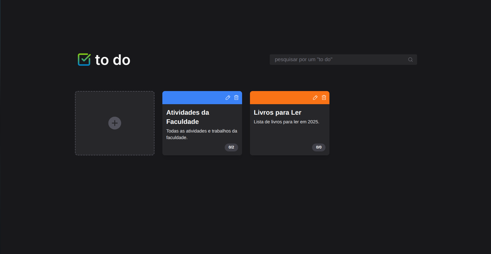
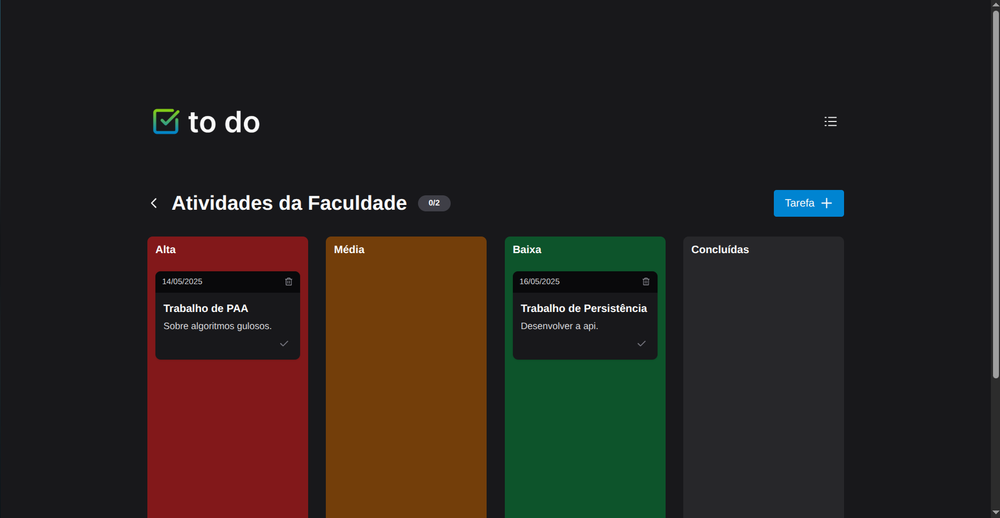
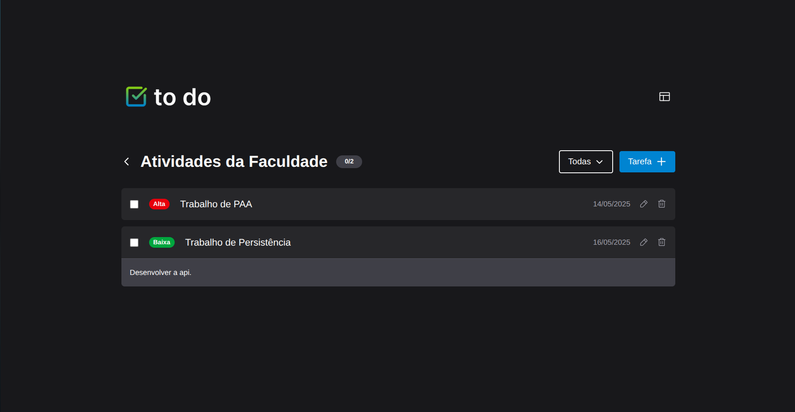
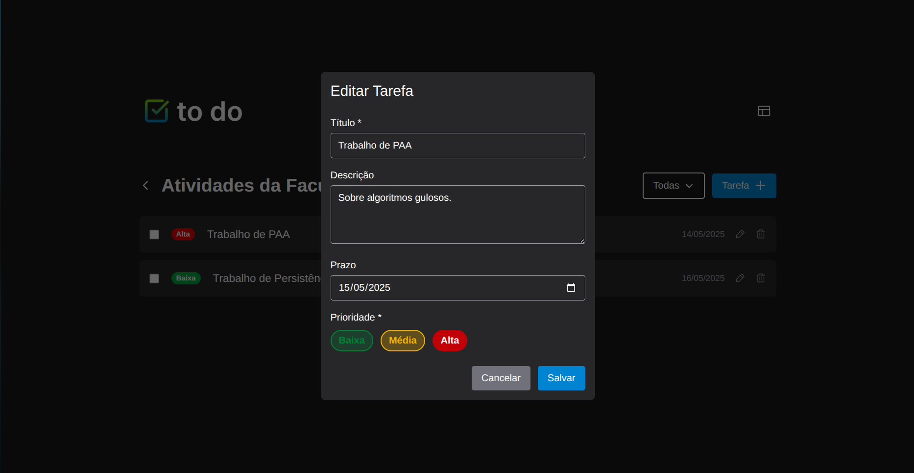
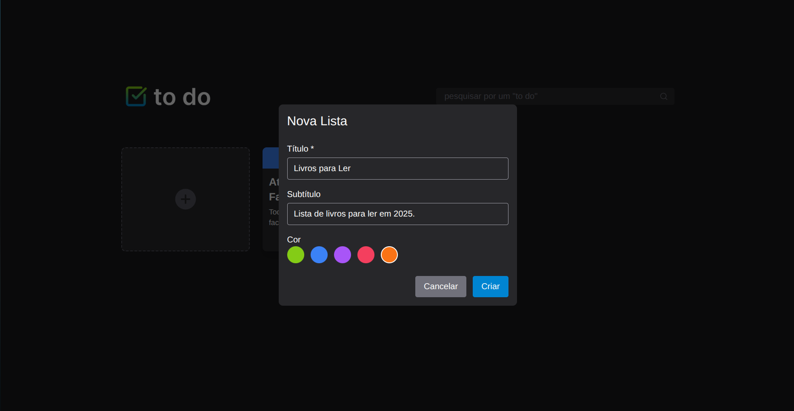

# ✅ TO DO List

Uma aplicação web para gerenciamento de tarefas, com visual moderno, responsivo e dois modos de visualização (kanban e lista).

🎯 [Protótipo no Figma](https://www.figma.com/design/uFUMwUxJg3eEBNVUayPbuO/TO-DO-List?node-id=0-1&t=U9HU0SwsNwF6vm40-1)

---

## ✨ Funcionalidades

- 📌 Criação de listas de tarefas personalizadas
- 🧩 Visualização em modo Kanban por prioridade
- 📃 Visualização em lista com filtro (de prioridade)
- 🗓️ Definição de prazo e prioridade
- 🔁 Edição e exclusão de tarefas e listas
- 💡 UI moderna com ícones e feedbacks visuais
- 🌙 Modo escuro por padrão

---

## 🖼️ Interface

### Home


### Modo Kanban


### Modo Lista


### Modal de edição de tarefa


### Criação de nova lista


### Confirmação de exclusão


---

## 🚀 Tecnologias e Bibliotecas

| Tecnologias | Descrição |
|-------------|-----------|
| [React](https://react.dev/) | Biblioteca principal de UI |
| [Vite](https://vitejs.dev/) | Ferramenta de build e dev server |
| [TypeScript](https://www.typescriptlang.org/) | Tipagem estática |
| [Tailwind CSS](https://tailwindcss.com/) | Estilização com utilitários |
| [React Hook Form](https://react-hook-form.com/) | Manipulação de formulários |
| [Zod](https://zod.dev/) | Validação de dados em formulários |
| [Axios](https://axios-http.com/) | Requisições HTTP |
| [React Router](https://reactrouter.com/en/main) | Roteamento SPA |
| [Phosphor Icons](https://phosphoricons.com/) | Ícones modernos e personalizáveis |

---

## 📦 Scripts disponíveis

```bash
# Executa a aplicação em modo desenvolvimento
npm run dev

# Compila para produção
npm run build

# Abre preview da build
npm run preview

# Verifica problemas de lint
npm run lint